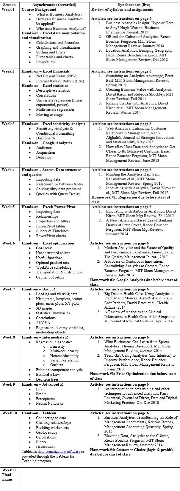

# syr_mads_scm651_business_analytics
Syracuse University, Masters of Applied Data Science -SCM 651 Business Analytics

SYRACUSE UNIVERSITY WHITMAN SCHOOL OF MANAGEMENT 

SCM 651 – Business Analytics        

Course Overview and Learning Objectives  
 
This course is intended for the graduate student who is interested in developing a portfolio of skills in business analytics.   
 
The course learning objectives include:  
 
1. Data collection: using tools to collect and organize data (e.g., Google Analytics)  
2. Data analysis: identify patterns in the data via visualization, statistical analysis, and data mining  
3. Strategy and decisions: develop alternative strategies based on the data 4. Implementation: develop a plan of action to implement the business decisions  
 
Class discussions will be based on case situations and on articles from business and technical publications. The class will include substantial hands-on work in data collection, analysis and interpretation. 
 
 
Assignments:  
1. Data visualization, correlation, and regression 
2. Google Analytics  
3. Demand modeling and price optimization  
4. Customer choice (logit, probit, neural networks)  
6. Team peer review  
7. Final Exam   
8. Class participation  

 
  Weekly Schedule:

